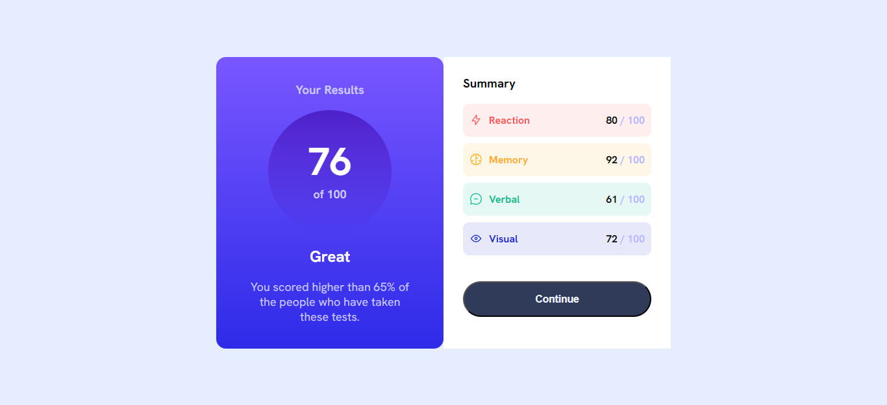
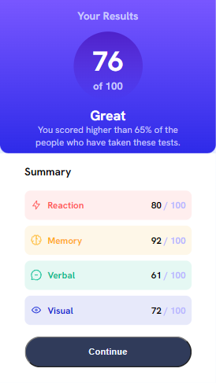

# Frontend Mentor - Results summary component solution

This is a solution to the [Results summary component challenge on Frontend Mentor](https://www.frontendmentor.io/challenges/results-summary-component-CE_K6s0maV). Frontend Mentor challenges help you improve your coding skills by building realistic projects. 

## Table of contents

- [Overview](#overview)
  - [The challenge](#the-challenge)
  - [Screenshot](#screenshot)
- [Links](#links)
- [My process](#my-process)
  - [Built with](#built-with)
  - [What I learned](#what-i-learned)
  - [Continued development](#continued-development)
  - [Useful resources](#useful-resources)
- [Author](#author)
- [Acknowledgments](#acknowledgments)

## Overview

### The challenge

Users should be able to:

- View the optimal layout for the interface depending on their device's screen size
- See hover and focus states for all interactive elements on the page

### Screenshot

## Links

Solution URL: https://diegoaparicior.github.io/results-summary-component-main/

## My process

- I started with desktop design.
- I made a main container with a css 'display: grid' with 2 equals columns.
- First column has a 'displa: flex' with 'flex-direction: column' and 'align-items: center'
- Second column has a container to skills and button, this column has a 'display: flex' and 'flex-direction: column' with 'justify-content: left'
- 

### Built with

- Semantic HTML5 markup
- CSS custom properties
- Flexbox
- CSS Grid

### Continued development

- Responsive.

## Author

- Frontend Mentor - [@DiegoAparicioR](https://www.frontendmentor.io/profile/DiegoAparicioR)

